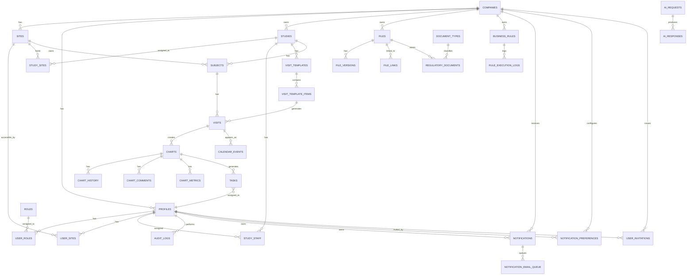

# ERD.md

# ClinicalOS Entity Relationship Design

Version: 1.0  
Product: ClinicalOS  
Document Type: Entity Relationship Diagram Specification  
Status: Approved for Database Design

---

## 1. Purpose

This document defines the main entity relationships for ClinicalOS.

It is intended to guide Claude during database implementation in Supabase/PostgreSQL.

The database follows a multi-tenant SaaS model.

Primary isolation key:

```text
company_id
```

Most operational records also include:

```text
site_id
```

---

## 2. High-Level ERD

```text
companies
   |
   |-- company_settings
   |-- company_modules
   |-- sites
   |-- profiles
   |-- roles
   |-- permissions
   |-- studies
   |-- business_rules
   |-- files
   |-- audit_logs
   |-- notifications
   |-- notification_preferences
   |-- notification_email_queue
   |-- user_invitations

profiles
   |
   |-- user_roles
   |-- user_sites
   |-- study_staff
   |-- tasks
   |-- audit_logs
   |-- notifications
   |-- notification_preferences
   |-- user_invitations (accepted_by)

sites
   |
   |-- study_sites
   |-- subjects
   |-- visits
   |-- calendar_events
   |-- charts
   |-- regulatory_documents
   |-- tasks

studies
   |
   |-- study_sites
   |-- study_staff
   |-- visit_templates
   |-- subjects
   |-- study_documents
   |-- regulatory_documents
   |-- study_ai_extractions

subjects
   |
   |-- visits
   |-- charts
   |-- subject_notes
   |-- subject_documents
   |-- subject_milestones
   |-- subject_timeline

visits
   |
   |-- charts
   |-- visit_history
   |-- visit_notes
   |-- calendar_events

charts
   |
   |-- chart_history
   |-- chart_comments
   |-- chart_metrics
   |-- chart_assignments
   |-- tasks

files
   |
   |-- file_versions
   |-- file_links
   |-- file_ai_metadata
   |-- regulatory_documents
   |-- study_documents
   |-- subject_documents
   |-- staff_documents
```

---

## 3. Core SaaS Relationships

### companies → sites

One company has many sites.

```text
companies.id = sites.company_id
```

### companies → profiles

One company has many users.

```text
companies.id = profiles.company_id
```

### companies → roles

One company has many roles.

```text
companies.id = roles.company_id
```

### profiles → roles

Many-to-many through `user_roles`.

```text
profiles.id = user_roles.user_id
roles.id = user_roles.role_id
```

### profiles → sites

Many-to-many through `user_sites`.

```text
profiles.id = user_sites.user_id
sites.id = user_sites.site_id
```

---

## 4. Study Relationships

### studies → study_sites

A study can be active in multiple sites.

```text
studies.id = study_sites.study_id
sites.id = study_sites.site_id
```

### studies → study_staff

A study can have multiple assigned staff members.

```text
studies.id = study_staff.study_id
profiles.id = study_staff.user_id
```

### studies → visit_templates

A study can have multiple template versions.

```text
studies.id = visit_templates.study_id
```

### visit_templates → visit_template_items

A template contains many visit definitions.

```text
visit_templates.id = visit_template_items.template_id
```

---

## 5. Subject Relationships

### studies → subjects

A study has many subjects.

```text
studies.id = subjects.study_id
```

### sites → subjects

Subjects belong to a site.

```text
sites.id = subjects.site_id
```

### subjects → subject_status_history

A subject has many status history records.

```text
subjects.id = subject_status_history.subject_id
```

### subjects → subject_timeline

A subject has many timeline events.

```text
subjects.id = subject_timeline.subject_id
```

---

## 6. Visits and Calendar Relationships

### subjects → visits

A subject has many visits.

```text
subjects.id = visits.subject_id
```

### visit_template_items → visits

Scheduled visits may reference the template item that generated them.

```text
visit_template_items.id = visits.visit_template_item_id
```

### visits → calendar_events

A Patient Visit has one related calendar event.

```text
calendar_events.related_record_type = 'visit'
calendar_events.related_record_id = visits.id
```

Manual events such as sponsor visits and monitoring visits exist only in `calendar_events`.

---

## 7. Charts and Data Entry Relationships

### visits → charts

A completed visit generates one chart.

```text
visits.id = charts.visit_id
```

### charts → chart_history

A chart has many status history records.

```text
charts.id = chart_history.chart_id
```

### charts → chart_metrics

A chart has calculated metrics.

```text
charts.id = chart_metrics.chart_id
```

### charts → tasks

A chart can generate one or more tasks.

```text
tasks.source_record_type = 'chart'
tasks.source_record_id = charts.id
```

---

## 8. Regulatory and Document Relationships

### document_types → regulatory_documents

Each regulatory document has a document type.

```text
document_types.id = regulatory_documents.document_type_id
```

### studies + sites → regulatory_binders

A binder belongs to a study and site.

```text
studies.id = regulatory_binders.study_id
sites.id = regulatory_binders.site_id
```

### files → regulatory_documents

Documents reference central files.

```text
files.id = regulatory_documents.file_id
```

### files → file_versions

A file can have multiple versions.

```text
files.id = file_versions.file_id
```

### files → file_links

A file can be linked to multiple records.

```text
files.id = file_links.file_id
```

---

## 9. Business Rules Relationships

### companies → business_rules

Rules are company-specific.

```text
companies.id = business_rules.company_id
```

### business_rules → rule_execution_logs

Every rule execution is logged.

```text
business_rules.id = rule_execution_logs.rule_id
```

Rules may act on:

- subjects
- visits
- charts
- documents
- tasks
- studies
- calendar_events

---

## 10. Clinical Intelligence Relationships

### ai_agents

AI agents are configured per company.

```text
companies.id = ai_agents.company_id
```

### ai_requests → ai_responses

Each AI request may produce one or more AI responses.

```text
ai_requests.id = ai_responses.ai_request_id
```

AI responses that modify data must require approval.

---

## 11. Audit Trail Relationships

### audit_logs

Audit logs can reference any record.

```text
audit_logs.record_type
audit_logs.record_id
```

Audit logs always include:

- company_id
- user_id
- module
- action
- old_value
- new_value
- created_at

Audit logs are immutable.

---

## 12. Mermaid ERD



---

## 13. Implementation Rules for Claude

1. Use UUID primary keys.
2. Use foreign keys wherever possible.
3. Use `company_id` on all tenant-owned tables.
4. Use `site_id` on site-specific tables.
5. Add indexes on all foreign keys.
6. Enable RLS on all business tables.
7. Do not hard delete operational records unless explicitly permitted.
8. Preserve history using status history and audit logs.
9. Never store files directly in modules; reference `files`.
10. AI outputs should reference source records and require approval before production writes.

---

## 14. Final ERD Rule

The database must be designed so that every operational action can answer:

```text
Who did it?
When did they do it?
What changed?
Which company?
Which site?
Which record?
```

That traceability is mandatory for ClinicalOS.
